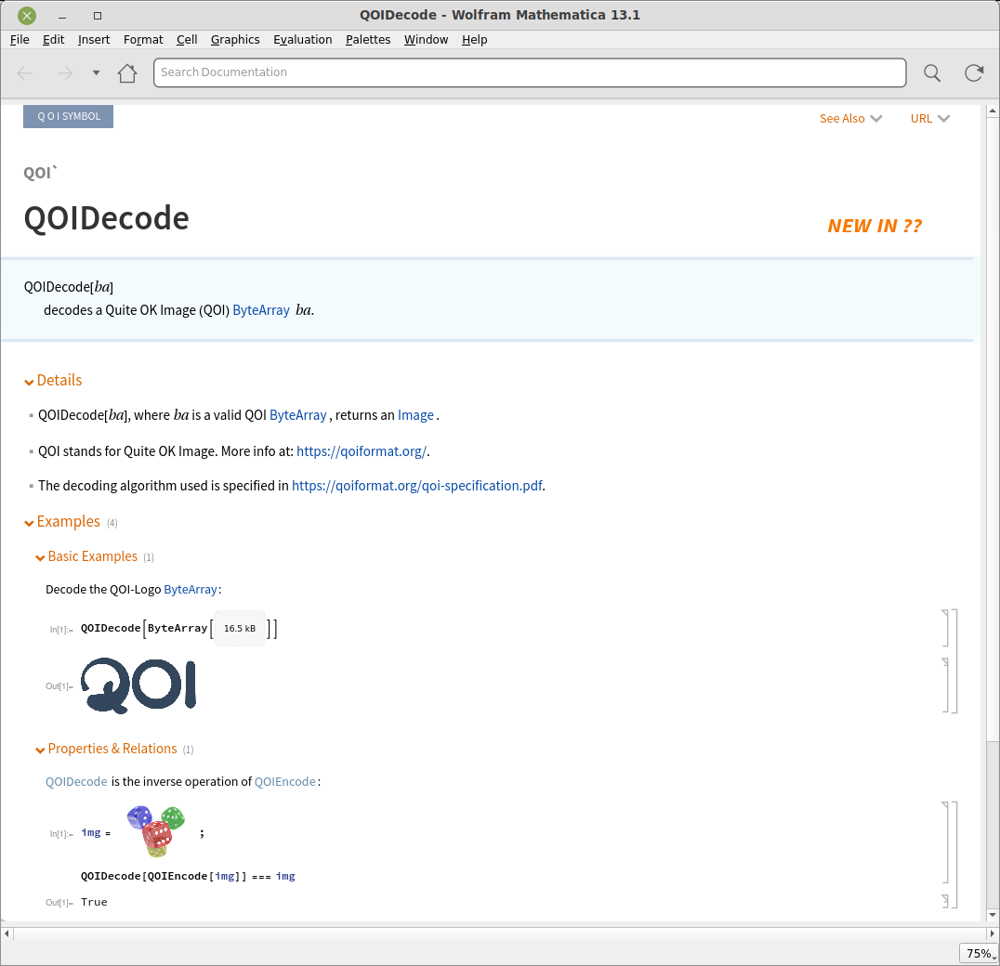

# QOI
A Wolfram Language paclet for manipulating the Quite OK Image (QOI) format (https://qoiformat.org/).

# Installation

Install the paclet (version `1.0`) from github releases:
```Mathematica
PacletInstall["https://github.com/daneelsan/wolfram-qoi/releases/download/release/QOI-1.0.paclet"]
```

# Usage

Load the QOI` package:
```Mathematica
Needs["QOI`"]
```

QOI symbols:
```Mathematica
In[]:= Names["QOI`*"]
Out[]= {"QOIDecode", "QOIEncode"}
```

Open the documentation of the `QOIDecode` function:
```Mathematica
NotebookOpen[Information[QOIDecode, "Documentation"]["Local"]]
```


# Build

1. The `qoi.h` library (https://github.com/phoboslab/qoi/qoi.h) is required for building the `LibraryLink` library.
Use the `get_qoi.sh` bash script to do this:
```bash
./scripts/get_qoi.sh
```

2. Build the `LibraryLink` library with the `build_library.wls` wolframscript:
```bash
./scripts/build_library.wls
```
   The library will be stored in `LibraryResources/$SystemID/`:
```bash
$ ls LibraryResources/Linux-x86-64
wolfram-qoi.so
```

3. Build the `QOI` paclet using the `build_paclet.wls` wolframscript:
```bash
./scripts/build_paclet.wls
```
   The paclet will be placed under the `build` directory:
```bash
$ ls build/*.paclet
build/QOI-1.0.paclet
```

4. Install the built paclet:
```Mathematica
PacletInstall[".../build/QOI-1.0.paclet"]
```
